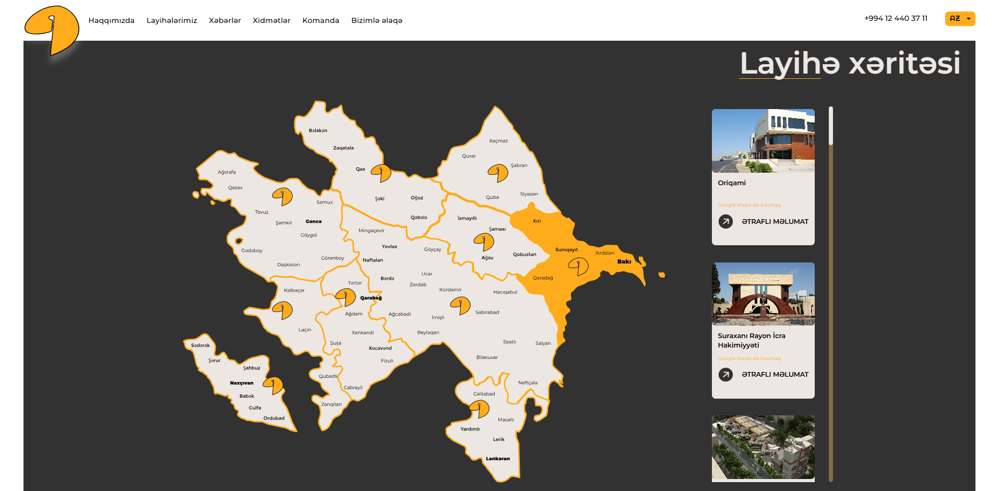
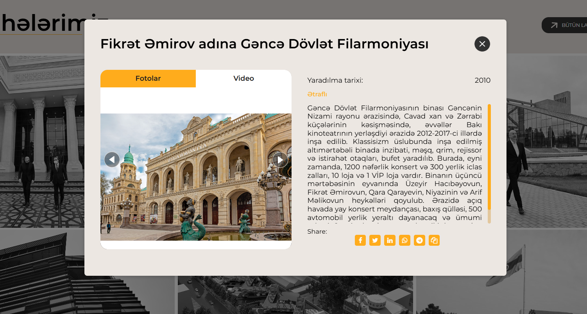
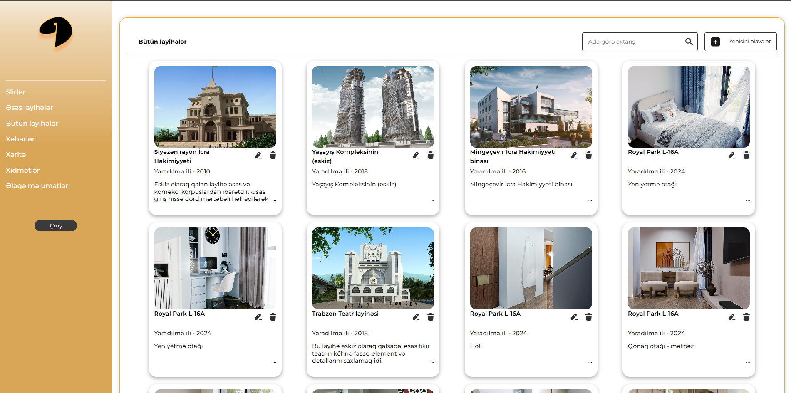
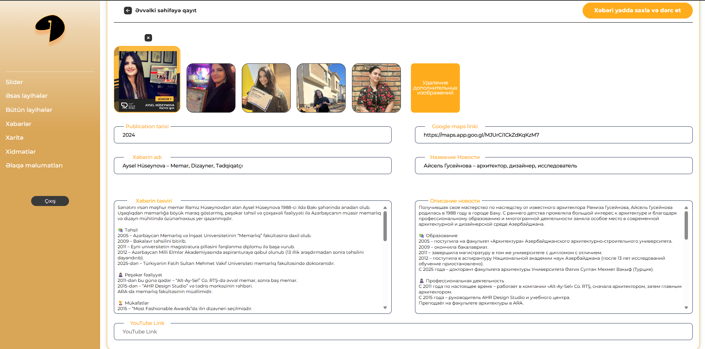
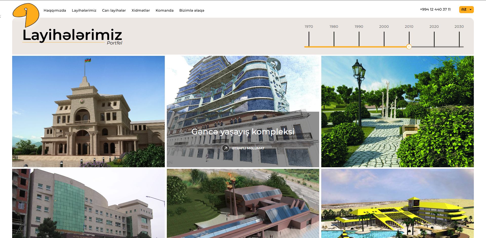

# 🏛️ Altaysel.az — Architectural Bureau Website

🔗 [Visit Live Site](https://altaysel.az/)  
🎨 UI design by [Lali Bagrationi](https://www.behance.net/ebb49210) · Built by [Daker.site](https://daker.site)

**Altaysel.az** is a professionally designed and developed Laravel-based website for a historical architectural bureau founded in the 1960s. The platform allows the team to showcase their rich portfolio of architectural projects across Azerbaijan, categorized by year, region, and project type.

---

## ✨ Key Features

- 🗺️ **Interactive Map**  
  Custom-built map allows users to browse architectural projects geographically, by region.

- 🧰 **Admin Dashboard**  
  Admins can:
  - Add/edit architectural projects
  - Upload project media
  - Assign projects to regions and years
  - Manage services and news
  - Preview live project updates instantly

- 📰 **News Module**  
  Add and manage news about company activity and industry insights.

- 📆 **Project Archive by Year**  
  Since the bureau has been active since the 1960s, projects are structured historically and filterable by year.

- 📤 **Social Media Sharing**  
  Each project page can be shared directly to social media platforms (Facebook, Twitter, WhatsApp, Telegram, etc.)

- 🌐 **Multi-language Ready**  
  Website architecture is prepared for internationalization.

---

## ⚙️ Tech Stack

| Layer           | Technology            |
|----------------|------------------------|
| **Backend**     | Laravel (PHP)          |
| **Frontend**    | Blade templates + JS   |
| **Database**    | MySQL                  |
| **Styling**     | Tailwind CSS           |
| **Map**         | Custom interactive JS map (geo-linked projects) |
| **Routing**     | Laravel routes/web.php |
| **SEO**         | Metadata, sharing-ready links |

---
## 📸 Screenshots

### 🗺️ Interactive Map
Custom-built JavaScript map allows users to browse architectural projects by region. Each marker links to a project with full details.

---

### 🏗️ Project Detail Page
Detailed project view with title, description, media, and the ability to instantly share the project on social media (Facebook, Twitter, WhatsApp, Telegram).

---

### 🛠️ Admin Panel — Project Editor
Secure admin panel with intuitive UI for editing architectural projects, assigning regions, uploading images, and setting project years.

---

### 📰 News Editor
Admins can create and publish news posts, keeping clients and partners informed about the bureau's activity and achievements.

---

### 📆 Project Timeline View
Users can browse all projects through a visual timeline slider, structured by decade and year — perfect for an archive-rich organization dating back to the 1960s.

